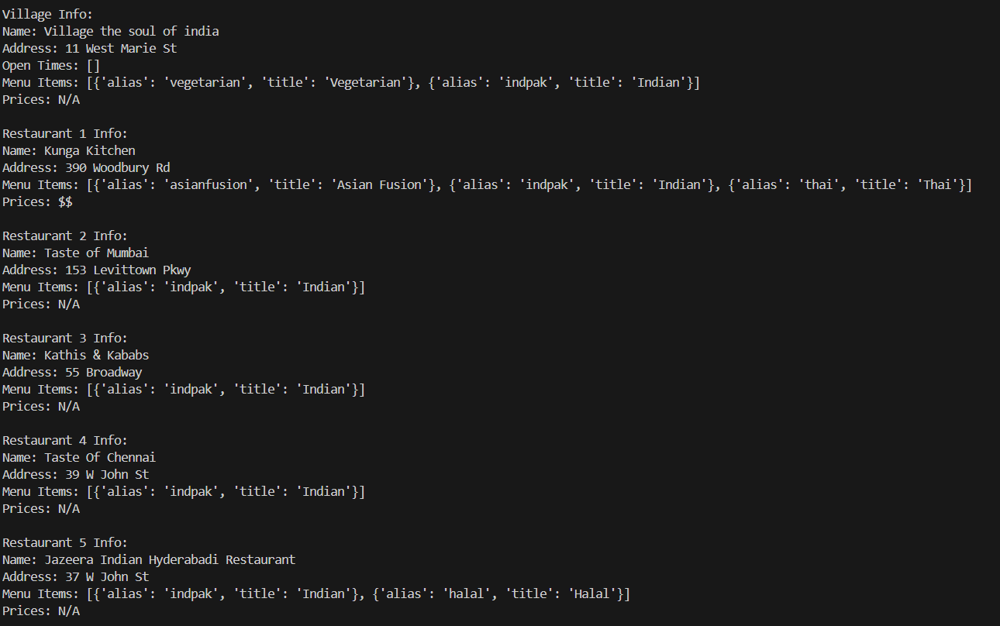
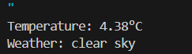
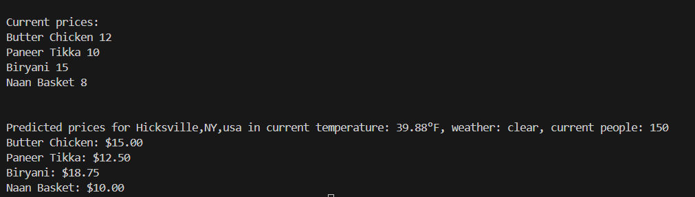

Create and Activate Virtual Environment:

```bash
python3 -m venv venv
source venv/bin/activate  # On Windows: venv\Scripts\activate
```

Install Dependencies:

```bash
pip install -r requirements.txt
```



